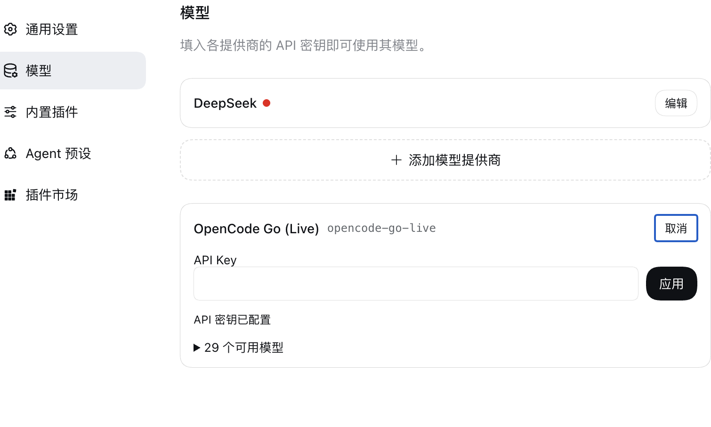
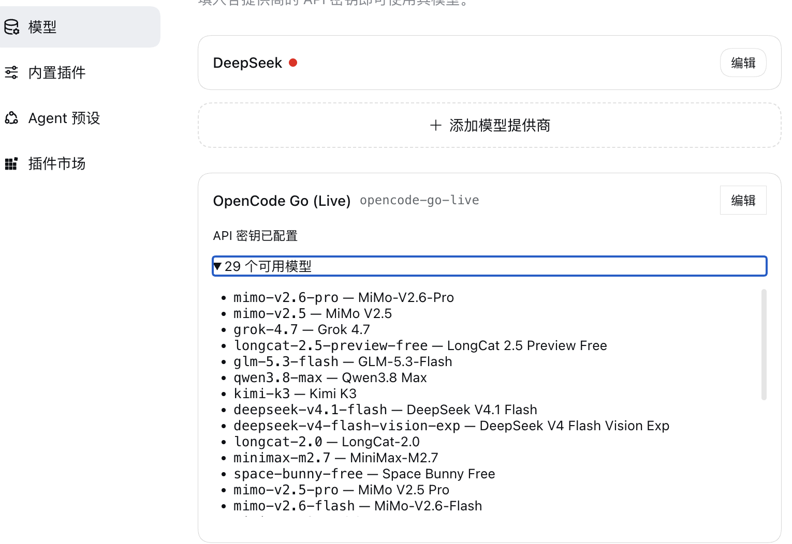
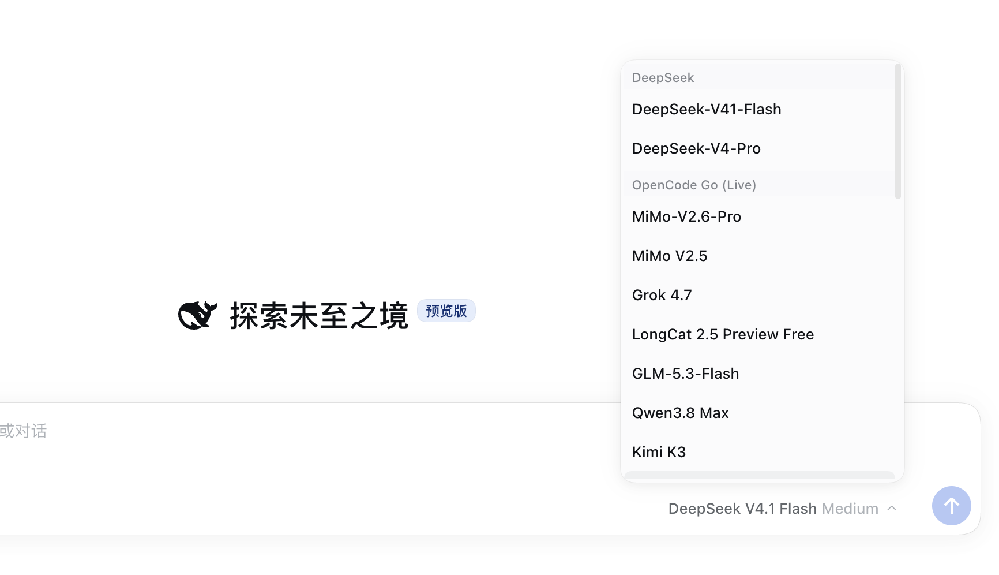
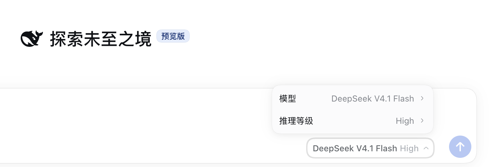

# @skylerfee/dsh-llm-opencode-go-live

[English](README.md) | 中文

DeepSeek Harness 的 OpenCode Go 动态模型目录插件。它从 Models.dev 更新 `opencode-go` 模型列表，注册独立的 `opencode-go-live` 路由，并由插件自己的浏览器入口在 Models 页显示供应商、密钥和动态模型；复用 pi-ai 处理模型请求；内置 `opencode-go` 路由不受影响。

## 快速开始

需要 Node.js 22.19 及以上（pi-ai 声明的最低版本）、pnpm，以及 DeepSeek Harness 0.1.7-rc.1 及以上。插件的 peer 依赖是 `@deepseek-ai/cordis` `~4.0.4`，以及 `@deepseek-ai/dsh-credentials`、`@deepseek-ai/dsh-llm`、`@deepseek-ai/dsh-llm-pi-ai`、`@deepseek-ai/dsh-settings` 的 `>=0.1.7-rc.1`——插件接入的图片输入钩子由这些版本提供。从 DSH 仓库根目录安装已发布 tag 的 bundle：

```sh
pnpm dsh plugin --profile web add github:SkylerFee/dsh-llm-opencode-go-live#v0.1.0-alpha.2
```

本地 checkout 或 `pnpm pack` 产出的 tarball 也可以安装——两条命令见[使用指南](docs/usage.zh.md#准备与安装)。

重启 Web profile 后，打开 **Settings → Models**，在插件提供的 **OpenCode Go (Live)** 卡片点击“编辑”，填写 API Key 并应用，再从模型选择器选择 `opencode-go-live` 下的模型。密钥由 DSH 凭据服务保存，默认引用名为 `OPENCODE_GO_LIVE_API_KEY`，该名称刻意区别于 Models 页为内置 `opencode-go` 派生的 `OPENCODE_GO_API_KEY`，两条路由不会共用同一条凭据记录；bundle 默认将模型目录快照保存在 Harness home 的 `cache/opencode-go-live.json`（默认即 `~/.dsh/cache/opencode-go-live.json`，设置 `$DSH_HOME` 时位于其下）。安装不会切换默认模型。

插件在 **Settings → Models** 中的卡片——密钥编辑态，以及目录解析后的动态模型列表：





在会话里，live 模型在模型选择器中自成一组，旁边可以选推理等级：





## 文档

- [使用指南](docs/usage.zh.md)：安装、密钥配置、配置字段与故障排查。
- [架构文档](docs/opencode-go-live-dynamic-catalog-design.zh.md)：组件职责、Mermaid 数据流与时序图、目录刷新和请求行为。

插件需要 DSH 的 `llm` 与 `credentials` 服务；Web 设置页还使用 `settings` 服务。刷新失败会保留上次成功目录，首次无目录时供应商可见但没有 live 模型；模型调用缺少凭据时返回 `MISSING_CREDENTIAL`。目录可见不代表 API 调用已获上游授权。

图片输入（`read_image` 工具结果或粘贴的截图）通过宿主的 durable 附件服务解析，与内置路由行为一致；未挂载附件服务时，携带图片的请求以 `UNSUPPORTED_CONTENT` 失败而不是静默丢弃。文件附件从不以原始字节发给任何 provider：请求组装层在所有路由上把文件块投影为确定性句柄文本。声明的输入模态跟随远端目录的 `modalities.input`（text 与 image），未声明图片输入的模型收到纯文本图片占位。

## 验证环境

**仅在 macOS 上验证过。** 插件安装、对 Models.dev 线上目录的刷新、Models 设置卡片以及模型调用都在同一台 macOS 机器上跑通过；Linux 与 Windows 从未实际运行。

CI 在 `ubuntu-latest` 上执行构建与离线测试套件。这只是构建信号，不是运行时验证：测试使用固定目录替身，没有任何自动化运行会访问真实的 OpenCode Go API。

## 许可证

MIT © 2026 SkylerFee，详见 [LICENSE](LICENSE)。
