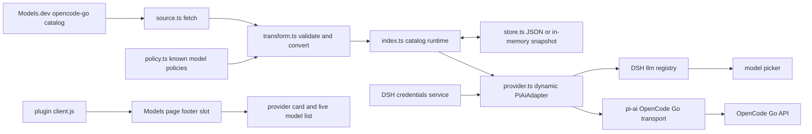
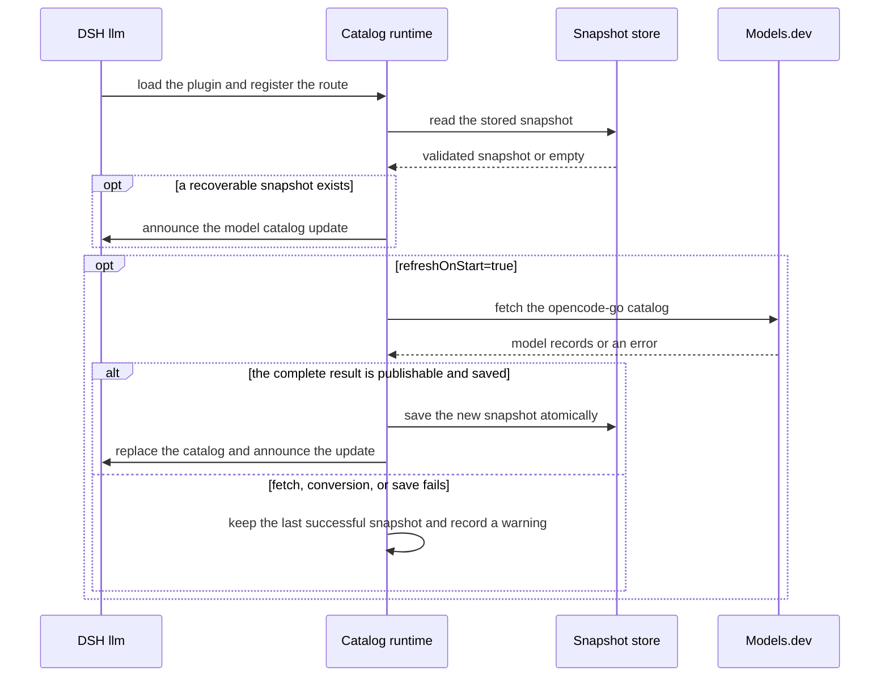
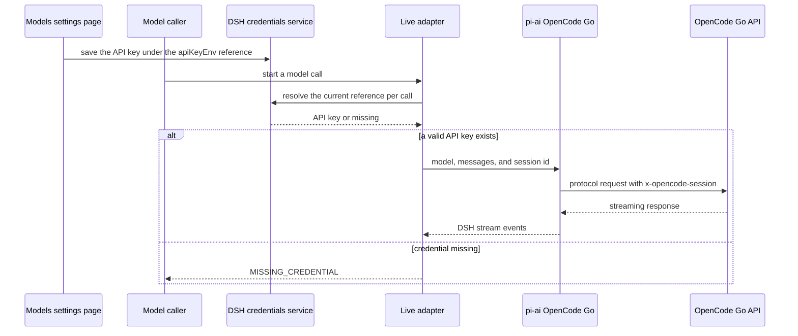

# OpenCode Go Live architecture

English | [中文](opencode-go-live-dynamic-catalog-design.zh.md)

This document describes the current catalog, credential, and request paths of `@deepseek-ai/dsh-llm-opencode-go-live`. Installation and operation steps are in the [usage guide](usage.md); configuration fields are in its [configuration reference](usage.md#configuration-reference).

## Components and data flow

The plugin registers only the `opencode-go-live` route. The built-in DSH `opencode-go` route and its static model catalog stay with the original plugin; switching to it requires the user to pick a model explicitly. `ctx.llm.registerAdapter()` supplies the actual models and the call capability; the plugin's own `client.js` draws the provider card through the existing DSH `settings.models.footer` slot and reads the current models from the session model catalog. Uninstalling the plugin removes the client entry with it; when it is not installed, the Models page of the main repository is unchanged. The route is registered before the catalog warms up, so the provider can appear even when the catalog is unavailable.

| File | Responsibility |
| --- | --- |
| `src/config.ts` | Parse the credential reference and the catalog refresh parameters. |
| `src/source.ts` | Read the Models.dev `opencode-go` provider through `@opencode-ai/models`. |
| `src/policy.ts` | Take known protocol policies from the current pi-ai OpenCode Go model table and give unknown models the generic Completions policy. |
| `src/transform.ts` | Validate source models and produce pi-ai models plus rejection diagnostics. |
| `src/store.ts` | Read and write the in-memory or JSON catalog snapshot. |
| `src/provider.ts` | Reuse `PiAiAdapter` and the pi-ai OpenCode Go transport, passing the session id upstream. |
| `src/index.ts` | Register the Cordis plugin, the model route, the refresh jobs, and credential resolution. |
| `client.js` | The browser entry distributed by the plugin; it provides on-demand key editing and the model list in the Models slot. |

## Catalog lifecycle

At startup the snapshot in the configured path is restored first, then a network refresh is attempted; a first refresh failure is retried at most 4 more times, 15 seconds apart. Afterwards refreshes run on `refreshIntervalMs`; a value of `0` starts no timer. Concurrent refreshes share one request. On uninstall the scheduled job is cancelled and an in-flight refresh is aborted and awaited.

Once a conversion has completed and been saved successfully, the runtime replaces the whole snapshot at once and then tells DSH to update the model list. Later model lookups and new requests use the new catalog; calls already prepared keep the model data from when they were prepared. A failed source fetch, conversion, or save retains the old snapshot. A legitimately empty catalog clears the models; if the source has entries but all of them are rejected for reasons other than deprecation, the old snapshot is retained.

When `catalog.cachePath` is configured, JSON storage first writes a temporary file with mode `0600` and then replaces the snapshot with `rename`; without that path the snapshot lives in memory only. The snapshot contains the check time, the converted models, and diagnostics; it never contains the API key, conversation requests, or responses. A snapshot that cannot be read or fails validation is treated as absent.

## Models and protocols

The Models.dev `opencode-go` catalog decides which models belong to the live route. Known models inherit the API protocol, endpoints, and compatibility parameters from the current pi-ai built-in model table; unknown models use the generic OpenAI Completions endpoint of OpenCode Go. The catalog never passes arbitrary source request headers or body fields upstream.

Deprecated models, models without a valid context or output limit, without text input, or whose tool-calling capability cannot be established do not enter the catalog; rejected entries produce diagnostics. Known policies may supply limits or input types the source lacks, but an input range the source states explicitly is never widened. Model prices are zeroed in the snapshot and are not used for billing.

## Credentials and requests

`apiKeyEnv` is a credential reference name, `OPENCODE_GO_API_KEY` by default; neither the configuration nor the catalog cache stores the key value. The plugin card reads the current reference from the DSH settings description and then writes the key through the credentials service; the adapter resolves the current reference on every request. A missing credential or an unavailable service returns `MISSING_CREDENTIAL`. All three supported request protocols set `x-opencode-session` from the DSH session id so the upstream can recognize the same conversation.

## Failures and boundaries

| Situation | Behavior |
| --- | --- |
| First start with no recoverable catalog and an unavailable source | The provider is visible, but no live model can be selected; check the startup log for a refresh warning. |
| A later catalog refresh fails | The most recent successful snapshot is retained; there is no automatic switch to the built-in `opencode-go`. |
| Models exist but the API key is missing | Calls return `MISSING_CREDENTIAL`; save the key on the Models settings page first. |
| The upstream rejects or rate-limits | pi-ai returns the corresponding call error; catalog refresh and API requests are two independent paths. |
| `opencode-go-live` is taken by another adapter | Registration fails; a route can be held by only one adapter. |

The plugin depends on the DSH `llm` and `credentials` services, and the plugin card additionally needs the DSH `settings` service and the `settings.models.footer` slot of the Models page. Catalog refresh uses the public Models.dev source and does not verify whether the key may call the OpenCode Go API; listing a model does not mean a request has already succeeded.
