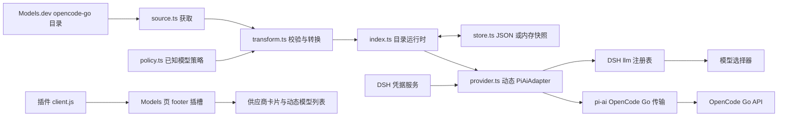
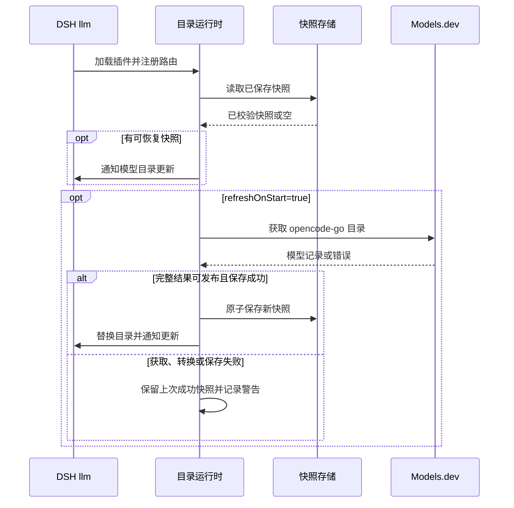
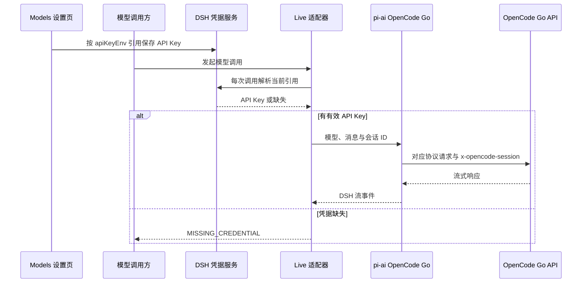

# OpenCode Go Live 架构

[English](opencode-go-live-dynamic-catalog-design.md) | 中文

本文描述 `@deepseek-ai/dsh-llm-opencode-go-live` 当前的目录、凭据和请求链路。安装与操作步骤见[使用指南](usage.zh.md)，配置字段见该指南的[配置参考](usage.zh.md#配置参考)。

## 组件与数据流

插件只注册 `opencode-go-live` 路由。DSH 内置的 `opencode-go` 路由及其静态模型目录由原有插件管理；切换到它需要用户显式选模型。`ctx.llm.registerAdapter()` 提供实际模型与调用能力；插件自己的 `client.js` 通过 DSH 已有的 `settings.models.footer` 插槽绘制供应商卡片，并从会话模型目录读取当前模型。插件卸载后客户端入口随之移除；未安装时主库的 Models 页保持原样。路由在目录暖机前注册，因此目录不可用时供应商仍可出现。

| 文件 | 职责 |
| --- | --- |
| `src/config.ts` | 解析凭据引用和目录刷新参数。 |
| `src/source.ts` | 通过 `@opencode-ai/models` 读取 Models.dev 的 `opencode-go` 提供方。 |
| `src/policy.ts` | 从当前 pi-ai OpenCode Go 模型表取得已知协议策略，为未知模型提供通用 Completions 策略。 |
| `src/transform.ts` | 校验来源模型，产出 pi-ai 模型和拒绝诊断。 |
| `src/store.ts` | 读取和保存内存或 JSON 目录快照。 |
| `src/provider.ts` | 复用 `PiAiAdapter` 和 pi-ai OpenCode Go 传输，将会话 ID 传给上游。 |
| `src/index.ts` | 注册 Cordis 插件、模型路由、刷新任务和凭据解析。 |
| `client.js` | 由插件分发的浏览器入口；在 Models 插槽中提供按需展开的密钥编辑和模型列表。 |

## 目录生命周期

启动时先恢复配置路径中的快照，再尝试网络刷新；首次刷新失败最多再重试 4 次，重试间隔 15 秒。随后按 `refreshIntervalMs` 定时刷新；值为 `0` 时不启动定时器。并发刷新共用同一请求。卸载时取消定时任务，中止并等待进行中的刷新。

转换完成并成功保存后，运行时一次替换整份快照，再通知 DSH 更新模型列表。后续模型查询和新请求使用新目录；已经准备的调用继续使用准备时的模型资料。来源获取、转换或保存失败时保留旧快照。合法空目录会清空模型；如果来源含有条目但全部因非弃用原因被拒绝，则保留旧快照。

bundle 默认把 `catalog.cachePath` 设为 Harness home 下的 `cache/opencode-go-live.json`（默认即 `~/.dsh/cache/opencode-go-live.json`，设置 `$DSH_HOME` 时位于其下），因此默认安装即跨重启持久化；手工挂载且未设置该字段时只保存于内存。配置该路径时，JSON 存储先写权限为 `0600` 的临时文件，再通过 `rename` 替换快照。快照包含检查时间、转换后的模型和诊断，不包含 API Key、对话请求或响应。无法读取或未通过校验的快照按不存在处理。

## 模型与协议

Models.dev 的 `opencode-go` 目录决定模型是否属于 live 路由。已知模型从当前 pi-ai 内置模型表继承 API 协议、端点和兼容参数；未知模型使用 OpenCode Go 的通用 OpenAI Completions 端点。目录不会把任意来源请求头或请求体字段传给上游。

弃用模型、无有效上下文或输出上限、缺少文本输入、无法确认工具调用能力的模型不会进入目录；被拒绝的条目产生诊断。已知策略可补充来源缺少的限制或输入类型，但来源明确声明的输入范围不会被扩大。模型价格在快照中填零，不用于计费。

## 凭据与请求

`apiKeyEnv` 是凭据引用名称，默认 `OPENCODE_GO_LIVE_API_KEY`；该默认名刻意不同于 Models 页为内置 `opencode-go` 路由派生的 `OPENCODE_GO_API_KEY`，两条路由不会解析同一条凭据记录。配置和目录缓存均不保存密钥值。插件卡片从 DSH 设置描述读取当前引用，再通过凭据服务写入密钥；适配器在每次请求时解析当前引用。凭据缺失或服务不可用时返回 `MISSING_CREDENTIAL`。三个受支持的请求协议均从 DSH 会话 ID 设置 `x-opencode-session`，供上游识别同一对话。

## 故障与边界

| 情况 | 行为 |
| --- | --- |
| 首次启动没有可恢复目录且来源不可用 | 供应商可见，但没有 live 模型可选；查看启动日志中的刷新警告。 |
| 后续目录刷新失败 | 保留最近一次成功快照；不会自动改走内置 `opencode-go`。 |
| 有模型但 API Key 缺失 | 请求返回 `MISSING_CREDENTIAL`；先在 Models 设置页保存密钥。 |
| 上游拒绝或限流 | pi-ai 返回相应调用错误；目录刷新与 API 请求是两条独立链路。 |
| `opencode-go-live` 被其他适配器占用 | 注册失败；一个路由只能由一个适配器持有。 |

插件依赖 DSH 的 `llm`、`credentials` 服务，插件卡片还需要 DSH 的 `settings` 服务及 Models 页的 `settings.models.footer` 插槽。目录刷新使用公开的 Models.dev 来源，不验证密钥是否有 OpenCode Go API 调用权限；能列出模型不等于请求已经成功。
