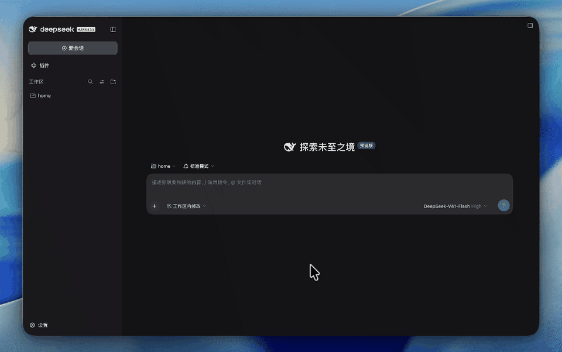
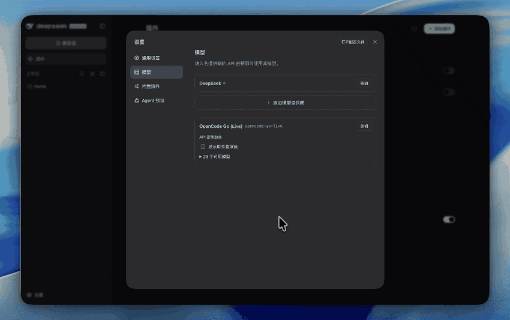
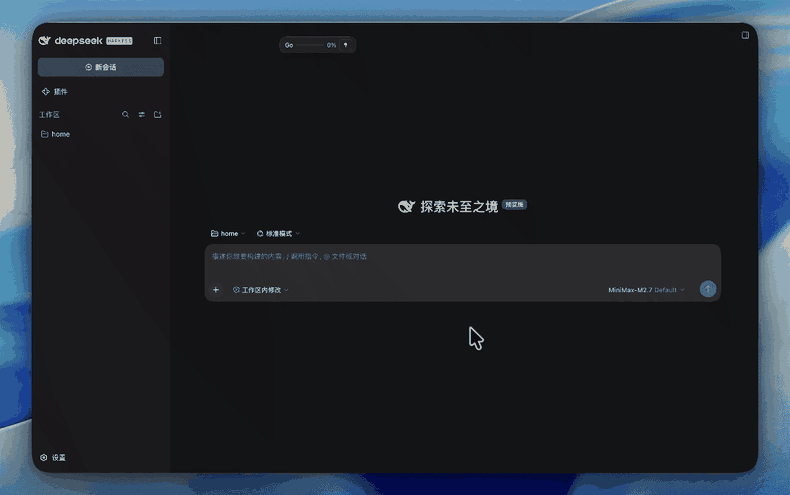

# 使用 OpenCode Go Live

[English](usage.md) | 中文

本指南适用于已安装 DeepSeek Harness 的 Web profile。插件提供独立的 `opencode-go-live` 路由，安装后可在 DSH 的 Models 供应商页面配置 API Key，并在模型选择器中选择动态目录模型。

## 准备与安装

需要 Node.js 22.19 及以上（pi-ai 声明的最低版本）、pnpm，以及 0.1.7-rc.1 及以上的 DeepSeek Harness Web profile。插件声明的 peer 依赖为 `@deepseek-ai/cordis` `~4.0.4`，以及 `@deepseek-ai/dsh-credentials`、`@deepseek-ai/dsh-llm`、`@deepseek-ai/dsh-llm-pi-ai`、`@deepseek-ai/dsh-settings` 的 `>=0.1.7-rc.1`。宿主还需提供 `@earendil-works/pi-ai` `^0.87.1`；DSH 在运行时将该 peer 解析到宿主的 pi-ai，链接源码目录安装时也适用。插件保留 pi-ai `0.87.1` 开发依赖，用于独立构建和测试。DSH 的 Web profile 必须能正常启动。

### 从 npm 安装

推荐从 npm 安装。使用已安装的 `dsh` CLI，将已发布的包加入 Web profile：

```sh
dsh plugin --profile web add @skylerfee/dsh-llm-opencode-go-live
```

不指定版本或标签时安装 `latest`。跟进预发布时，在包名后加 `@alpha`；固定本次发布版本时，加 `@0.2.0`。安装后重启 Web profile。

从源码运行 DSH 时，在 DSH 仓库根目录执行：

```sh
pnpm dsh plugin --profile web add @skylerfee/dsh-llm-opencode-go-live
```

安装会把包内 `cordis.patch.yml` 加入 Web profile 的 bundle 层，设置默认凭据引用 `OPENCODE_GO_LIVE_API_KEY`，并将目录快照放在 Harness home 的 `cache/opencode-go-live.json`（默认即 `~/.dsh/cache/opencode-go-live.json`，设置 `$DSH_HOME` 时位于其下）。安装不会更改默认模型。安装或更新 bundle 后重启 Web profile；从源码运行 DSH 时，主仓库需要已有构建产物。

### 从源码安装

开发或调试插件时，在 DSH 仓库根目录执行以下命令，将默认的 `main` 分支克隆到 DSH 同级目录、构建并安装。已有处于 `main` 分支的源码 checkout 时，跳过克隆命令，并在后续命令中使用该目录的路径：

```sh
git clone https://github.com/SkylerFee/dsh-llm-opencode-go-live.git ../dsh-llm-opencode-go-live
pnpm --dir ../dsh-llm-opencode-go-live install
pnpm --dir ../dsh-llm-opencode-go-live run check
pnpm dsh plugin --profile web add ../dsh-llm-opencode-go-live
```

profile 会将插件记为指向源码目录的 `link:` 依赖，因此要保留该目录。随后确认 profile 能访问构建后的入口文件：

```sh
ls ~/.dsh/profiles/web/node_modules/@skylerfee/dsh-llm-opencode-go-live/lib/index.js
```

如果设置了 `DSH_HOME`，则在该目录下的 `profiles/web/node_modules/` 中检查。

如果希望安装后不依赖源码目录，可在已构建的插件目录运行 `pnpm pack`，再从 DSH 仓库根目录执行 `pnpm dsh plugin --profile web add /absolute/path/to/skylerfee-dsh-llm-opencode-go-live-0.2.0.tgz` 安装生成的 tarball。

已安装 `dsh` CLI 的环境，也可在 DSH 仓库根目录将最后一行改为 `dsh plugin --profile web add ../dsh-llm-opencode-go-live`。

同样的安装与启用流程也可以在 Web 客户端的插件页完成：



## 配置密钥并使用模型

1. 启动 Web profile，打开 **Settings → Models**，找到由插件提供的 **OpenCode Go (Live)** 卡片。
2. 卡片默认只显示密钥状态和模型列表；点击“编辑”后在 **API Key** 输入框填写 OpenCode Go 密钥并应用，或点击“取消”放弃输入。密钥写入 DSH 凭据服务，页面不会回显已保存的值；状态提示表示已确认该引用有凭据。
3. 等待动态目录加载，展开卡片的模型列表，或在模型选择器查看 `opencode-go-live` 下的模型。选择其中一个模型发起对话；需要作为默认模型时，在 DSH 的默认模型设置中选择该路由和模型。

模型目录来自 Models.dev，获取目录不需要 API Key；真正请求 OpenCode Go API 时才会解析密钥。选择模型后若仍无法调用，请按下方[排查](#排查)先区分凭据错误与上游响应。



## 用量悬浮窗

卡片中的**显示用量悬浮窗**开关控制右下角的用量控件。该开关写入插件配置 `showBalanceOverlay`，**未配置时的默认值是开启**，因此新装即显示，重启 profile 后保持。若宿主读取不到该字段（例如尚未写入过配置），同样按开启处理。

徽章移入展开为完整面板、移出自动收起的过程：



**默认形态是徽章**：只占右下角一小块，显示 5 小时窗口的进度条与用量百分比，并带两个按钮（固定展开、固定位置）：

| 操作 | 行为 |
| --- | --- |
| 鼠标移入徽章 | 展开完整面板（三个计费窗口 + 更新时间）。 |
| 鼠标移出 | 自动收起为徽章，无需按钮（固定展开时除外）。 |
| 拖动徽章或面板（未固定时） | 移动位置；面板内除按钮、调整手柄以外的区域都可拖。拖动结束后的点击不会被当成展开。 |
| 点击徽章主体 | 在不支持悬浮的设备上展开面板。 |
| 点击固定展开按钮 | 让面板常驻展开、移开鼠标也不收起。图标为矢量方形框加箭头：**实心=已固定展开，空心=未固定**，**默认不固定展开**。再次点击即取消。 |
| 点击固定位置按钮 | 锁定／解除锁定当前位置。图标为矢量图钉：**实心=已固定，空心=未固定**，**默认不固定**。固定后徽章与面板都不能再拖动。 |

「固定展开」与「固定位置」互不影响：前者决定面板是否常驻展开，后者决定位置能否拖动。

完整面板展示 OpenCode Go 订阅在三个计费窗口中的用量：

| 窗口 | 含义 |
| --- | --- |
| 5 小时 | 滚动窗口，额度为月额度的 20%。 |
| 本周 | 周窗口，额度为月额度的 50%。 |
| 本月 | 月窗口，额度为 100%；用尽即进入 `rate-limited`。 |

每行显示百分比、进度条与重置倒计时；进度条在接近上限时转为琥珀色，进入 `rate-limited` 后转为错误色。面板标题栏的按钮为：

| 按钮 | 行为 |
| --- | --- |
| 固定展开 | 与徽章上的按钮是同一个状态，切换面板是否常驻展开。 |
| 图钉 | 固定／解除固定位置，与徽章上的按钮是同一个状态。 |
| ⟳ 刷新 | 立即重新查询（10 秒节流）。 |
| × 关闭 | 把插件配置的 `showBalanceOverlay` 写成 `false`，**模型页卡片里的开关同步关闭**；要重新显示，请在卡片中重新打开开关。 |

### 调整面板大小

展开面板的右下角有一个调整手柄（两条斜线，指针为斜向缩放）：

| 操作 | 行为 |
| --- | --- |
| 拖动手柄 | 同时改变面板宽度与高度；手柄拖到任意位置都不会移动面板本身。 |
| 方向键（手柄聚焦时） | ←／→ 改宽度，↑／↓ 改高度，每次 16px。 |
| 尺寸限制 | 最小 200×120，最大 480×520；视口更小时上限进一步收缩（保留 24px 边距），永远不会小于最小值。 |

默认宽度为 264px、高度随内容自适应；一旦调整过，宽高都会固定下来，超出部分在内容区内部滚动（标题行与手柄始终可见）。尺寸保存在浏览器 `localStorage`，手工改坏或换了更小的窗口后，会在挂载时收敛到合法区间。

面板没有最小化按钮：鼠标移开就会自动收起为徽章（固定展开时除外）。位置、固定位置、固定展开与尺寸都属于浏览器本地界面偏好（`localStorage` 的 `opencode-go-live.overlay.pos`／`.pinned`／`.expanded`／`.size`），不写入插件配置；是否展示由插件配置决定。

数据由宿主的余额路由 `GET /api/opencode-go-live/balance` 获取：宿主用 `apiKeyEnv` 引用的凭据向 `https://opencode.ai/zen/go/v1/usage` 发起请求，只把归一化的用量结果交给浏览器，API Key 不会离开宿主进程。该端点未出现在 OpenCode 公开文档中，属于上游实现约定；若上游调整端点，用量面板会显示查询失败而不是影响模型调用。

面板在挂载时查询一次，之后每 5 分钟自动刷新，也可以点刷新按钮手动查询（10 秒内不会重复发起）。密钥更新后会自动重新查询。

## 配置参考

bundle 自带的 `cordis.patch.yml` 已把 `catalog.cachePath` 设为 `dshHomePath('cache', 'opencode-go-live.json')`，因此默认安装即持久保存目录。手工挂载 Cordis 插件时，可在所属配置中使用以下字段；`apiKeyEnv` 填凭据引用名称，不填密钥值：

```yaml
llm-opencode-go-live:
  apiKeyEnv: OPENCODE_GO_LIVE_API_KEY
  catalog:
    cachePath: /absolute/path/to/opencode-go-live.json
    refreshOnStart: true
    refreshIntervalMs: 21600000
    refreshTimeoutMs: 10000
  showBalanceOverlay: true
```

| 字段 | 默认值 | 作用 |
| --- | --- | --- |
| `apiKeyEnv` | `OPENCODE_GO_LIVE_API_KEY` | 每次模型调用时由 DSH 凭据服务解析的引用；与内置 `opencode-go` 路由使用的引用相互独立。 |
| `catalog.cachePath` | `dshHomePath('cache', 'opencode-go-live.json')` | 绝对路径；bundle 默认指向 Harness home 下的 `cache/opencode-go-live.json`（默认即 `~/.dsh/cache/opencode-go-live.json`，设置 `$DSH_HOME` 时位于其下），目录由此跨重启恢复。只有手工挂载且不设置该字段时才仅保存在内存。 |
| `catalog.refreshOnStart` | `true` | 启动时从 Models.dev 刷新目录。 |
| `catalog.refreshIntervalMs` | `21600000` | 后续刷新间隔，单位毫秒；`0` 禁用定时刷新。 |
| `catalog.refreshTimeoutMs` | `10000` | 单次目录请求超时，单位毫秒；`0` 禁用超时。 |
| `showBalanceOverlay` | `true` | 是否显示用量悬浮窗；由 Models 卡片内的开关读写，Host 运行时不读取该值。 |

目录字段由插件配置管理，插件的 Models 卡片仅编辑 API Key 与用量悬浮窗开关。刷新开始前会尝试恢复快照；刷新失败保留最近一次成功目录。API Key 不会写入目录快照。

## 排查

| 现象 | 检查与处理 |
| --- | --- |
| 看不到 OpenCode Go (Live) 供应商 | 检查插件是否安装在当前 `web` profile，重启该 profile，并查看启动日志中的插件加载错误。 |
| 插件装上了但供应商始终不出现，且装出的包缺少 `lib/index.js` | 在源码目录运行 `pnpm run check` 完成构建，再重新安装该目录，或打包并安装生成的 tarball。 |
| 供应商可见但没有 live 模型 | 检查 DSH 进程能否访问 Models.dev；首次加载没有快照时会保持空目录，启动刷新失败会写入警告。 |
| 返回 `MISSING_CREDENTIAL` | 在插件的 Models 卡片保存 API Key；确认运行中的 DSH 使用同一 profile 和凭据引用。若从默认引用为 `OPENCODE_GO_API_KEY` 的旧版本升级，需要为本卡片重新填写一次密钥。 |
| 模型可选但 API 调用失败 | 目录加载与模型调用相互独立。查看 DSH 的调用错误和服务日志，按错误码区分认证、权限、限流和网络问题；不要在日志或工单中粘贴密钥。 |
| 刷新后仍显示旧模型 | 查看刷新警告；来源失败、全无效或快照保存失败时，插件保留上次成功目录。 |
| 开关已打开但看不到悬浮窗 | 悬浮窗挂在浏览器帧的浮层上，请确认当前页面是 Web 客户端而不是终端会话；若是点过面板的 × 关闭，模型页开关会同步变成关闭，重新打开该开关即可。 |
| 只看到右下角一个小徽章 | 这是默认形态：徽章显示 5 小时窗口的进度条与用量百分比，鼠标移入即展开完整面板，移出自动收起。 |
| 悬浮窗拖不动 | 处于固定位置状态，点击图钉按钮（实心即已固定）解除后即可拖动；徽章与面板都可拖动。 |
| 悬浮窗在顶部拖动时整个界面（窗口）跟着动 | 旧版缺陷：宿主按几何合成窗口拖拽区，悬浮窗移到顶部与窗口拖拽行重叠后不在减除之列。本修复让悬浮窗整体声明 `no-drag`，并在展开、移动、调整大小与数据变化后请求宿主重算拖拽区；升级插件并重载客户端后生效。 |
| 展开后移开鼠标不收起 | 处于固定展开状态，点击方形框箭头按钮（实心即已固定展开）即可取消。 |
| 面板太窄／太高，或调整后没变化 | 尺寸被限制在 200×120 与 480×520 之间，且不超过视口；面板右下角的手柄可拖动调整，聚焦手柄后也可用方向键。清除 `opencode-go-live.overlay.size` 可回到默认宽度与自适应高度。 |
| 悬浮窗位置或固定状态不对 | 这些偏好保存在浏览器 `localStorage`（键名 `opencode-go-live.overlay.*`），清除这些键即可恢复默认（右下角、不固定位置、不固定展开、默认尺寸）。 |
| 悬浮窗显示“API 密钥缺失” | 卡片尚未保存密钥，或当前 profile 使用的是另一个凭据引用；在卡片中重新填写并应用。 |
| 悬浮窗显示“没有 OpenCode Go 订阅” | 上游返回 403，表示该密钥所在账号没有 Go 订阅（Zen 预付余额也不在此面板范围内）。 |
| 悬浮窗显示“查询失败” | 宿主无法访问 `https://opencode.ai/zen/go/v1/usage`，或该端点已随上游调整；模型调用不受影响，可按上方端点说明核对。 |

`opencode-go-live` 不会自动回退到内置 `opencode-go`。需要回退时，在模型选择器或默认模型设置中显式选择内置路由。

## 开发验证

在插件目录运行 `pnpm run check` 执行 TypeScript 构建与离线测试；发布前运行 `pnpm pack --dry-run` 检查包内容。测试使用固定目录替身与固定用量替身，不访问真实模型 API 或用量端点。目录与调用链路的实现说明见[架构文档](opencode-go-live-dynamic-catalog-design.zh.md)，用量悬浮窗的数据源与路由契约见[用量悬浮窗设计](opencode-go-live-balance-overlay-design.zh.md)。
